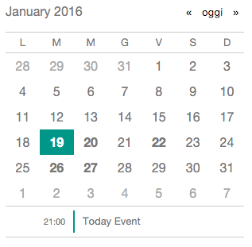

# AngularJS Tiny Calendar

A (very) small calendar directive, which can also handle events



## Demo

[Live demo](http://camilloaddis.github.io/angular-tiny-calendar/).

## Installation

#### Dependencies

The Tiny Calendar requires:
* AngularJs 1.2.8+
* Moment.js
* Moment-range.js

#### Bower

Install it via [Bower](http://bower.io)

```
bower install --save angular-tiny-calendar
```

include `tiny-calendar.min.js` and `tiny-calendar.min.css` into your project

```html
<!-- Include css reference inside the <head> tag-->
<head>
<!-- ... -->
	<link rel="stylesheet" href="bower_components/angular-tiny-calendar/tiny-calendar.min.css">
</head>
<!-- Load the scrips at the end of the body -->
<!-- AngularJs and Moment.js are required -->
<script type="text/javascript" src="https://cdnjs.cloudflare.com/ajax/libs/angular.js/1.4.8/angular.min.js"></script>
<script type="text/javascript" src="https://cdnjs.cloudflare.com/ajax/libs/moment.js/2.11.1/moment.min.js"></script>
<script type="text/javascript" src="https://cdnjs.cloudflare.com/ajax/libs/moment-range/2.1.0/moment-range.min.js"></script>

<!-- ... -->
<!-- Include js reference -->
<script type="text/javascript" src="bower_components/angular-tiny-calendar/tiny-calendar.min.js"></script>
```

add `angular-tiny-calendar` as a module dependency for your app.

```javascript
angular.module('myApp', ['angular-tiny-calendar']);
```


## Usage

Simply add a `tiny-calendar` attribute to a `<div>` tag (or any container)

```html
<div tiny-calendar></div>
```

### Options

Tiny Calendar accepts 4 parameters:

#### first-day (number)

`first-day` is used to set the first day of the week (default is 0 - Sunday).

```html
<!-- This will set the first day on Monday -->
<div tiny-calendar first-day="1"></div>
```

#### week-days (string)

`week-days` is used to customize the labels of the days (remember to start with Sunday even if `first-day` is set)

```html
<div tiny-calendar week-days="DLMMGVS"></div>
```

#### today (string)

`today` sets the label for the _today_ button

```html
<div tiny-calendar today="oggi"></div>
```


#### events (object)

The `events` argument *must* be passed *an array of objects*, each one including:
* `title` - Required. The title of the event.
* `startDate`- Required. The date of the event.
* `endDate` - Optional. The end date of the event.
* `time` - Optional. The day schedule of the event. If this is omitted the event will be considered "all day long"

```json
events: [
  {
    "title": "Today Event",
    "startDate": "2016-01-19T22:45:15.739Z",
    "endDate": null,
    "time": "21:00"
  },
  {
    "title": "Tomorrow",
    "startDate": "2016-01-20T22:45:15.739Z",
    "endDate": null,
    "time": "17:15"
  },
  {
    "title": "All-day event",
    "startDate": "2016-01-22T22:45:15.739Z",
    "endDate": null
  },
  {
    "title": "Two in one day!",
    "startDate": "2016-01-22T22:45:15.739Z",
    "endDate": null,
    "time": "09:00"
  },
  {
    "title": "Three in one day!",
    "startDate": "2016-01-22T22:45:15.739Z",
    "endDate": null,
    "time": "15:00"
  },
  {
    "title": "Multi-day event",
    "startDate": "2016-01-26T22:45:15.739Z",
    "endDate": "2016-01-27T22:45:15.739Z"
  }
]
```

## License

This sowftware is licensed under the MIT license

